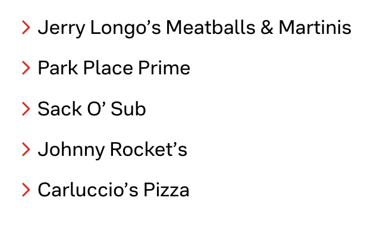

# Lists

This is the standard HTML markup for an unordered list:

```html
<ul>
  <li>List item</li>
  <li>List item</li>
  <li>List item</li>
  <!-- etc -->
</ul>
```

Vizergy renders all `<ul>` tags like this, with a red angle bracket instead of a bullet:



Their implementation leads to a few challenges on styling lists that aren't left aligned.

## Centered lists

When using `ul` elements in center aligned sections, the bullet will stay on the far left of the box. To remedy this, I have used this code where lists need to be centered:

```html
<ul
  style="display:flex;flex-direction:column;align-items:center;width:fit-content;margin-inline:auto">
  <li style="width:fit-content">List item</li>
  <li style="width:fit-content">List item</li>
  <li style="width:fit-content">List item</li>
  <!-- etc -->
</ul>
```

## Unstyled lists

I have not found a good way to remove these bullet images - rather than replacing the bullet with the CSS `list-style-image` property, they have used the `::before` element on each list item.

If the client gives you a long list of items, but doesn't want the red angle brackets, I recommend the following HTML markup:

```html
<div role="list">
  <div role="listitem">List item</div>
  <div role="listitem">List item</div>
  <div role="listitem">List item</div>
  <!-- etc -->
</div>
```

